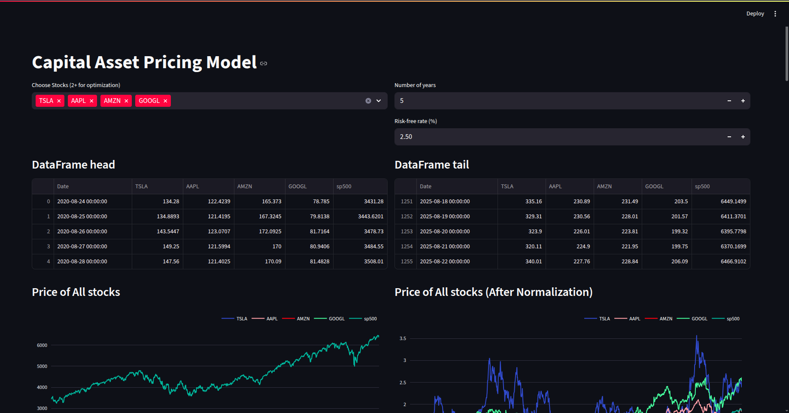
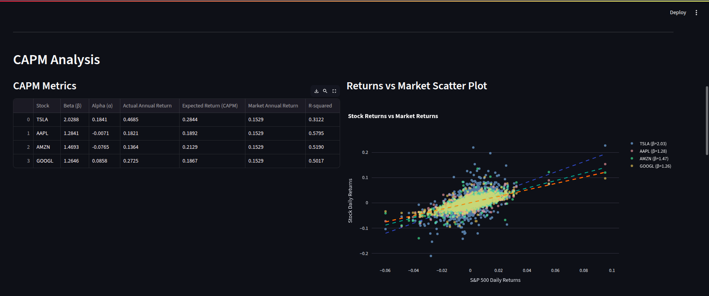
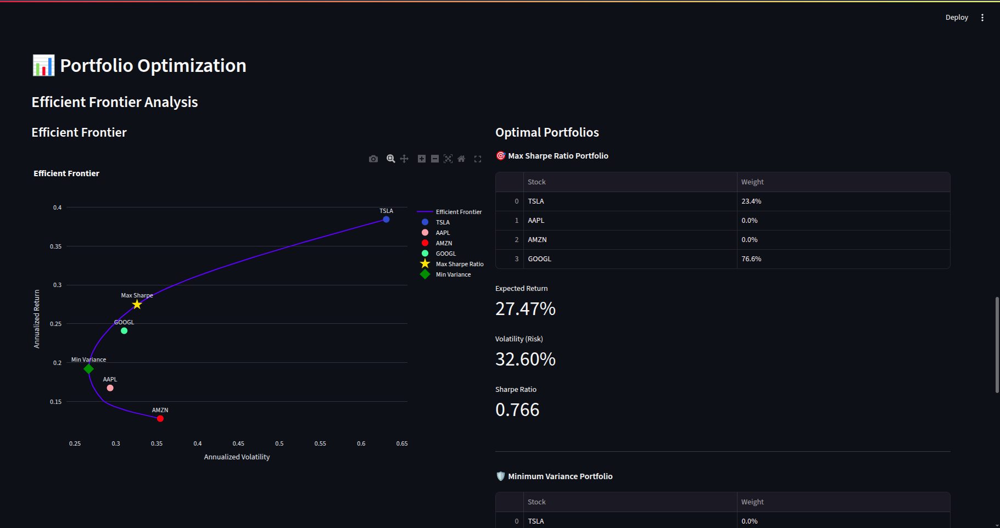
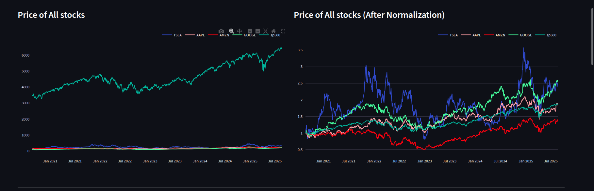

# CAPM Web Application 📈

A comprehensive Capital Asset Pricing Model (CAPM) and Portfolio Optimization web application built with Streamlit.

## Features

- **📊 CAPM Analysis**: Calculate Beta, Alpha, and Expected Returns
- **⚡ Portfolio Optimization**: Modern Portfolio Theory implementation
- **📈 Efficient Frontier Visualization**: Risk-return tradeoff analysis
- **🔗 Correlation Matrix**: Stock correlation heatmaps
- **🎯 Interactive Charts**: Plotly-powered visualizations

## Demo

### Main Dashboard


### CAPM Analysis


### Portfolio Optimization


### Efficient Frontier


## Installation

1. Clone the repository:
```bash
git clone https://github.com/iamganguly-2002/CAPM-Web-Application.git
cd CAPM-Web-Application

